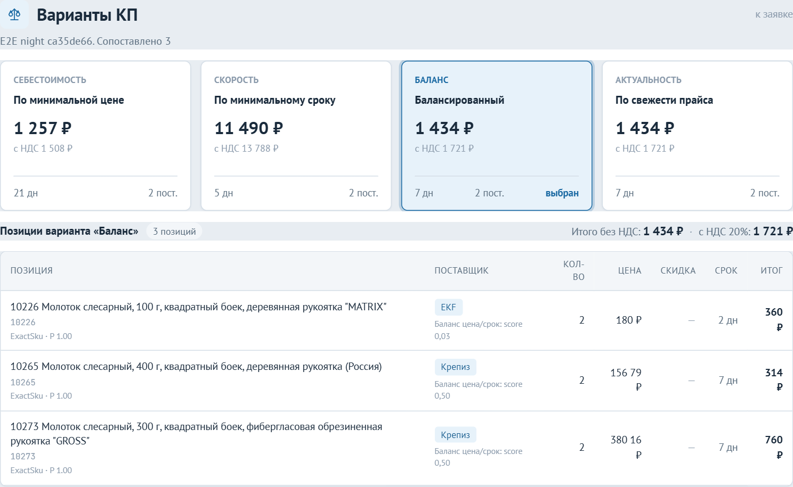
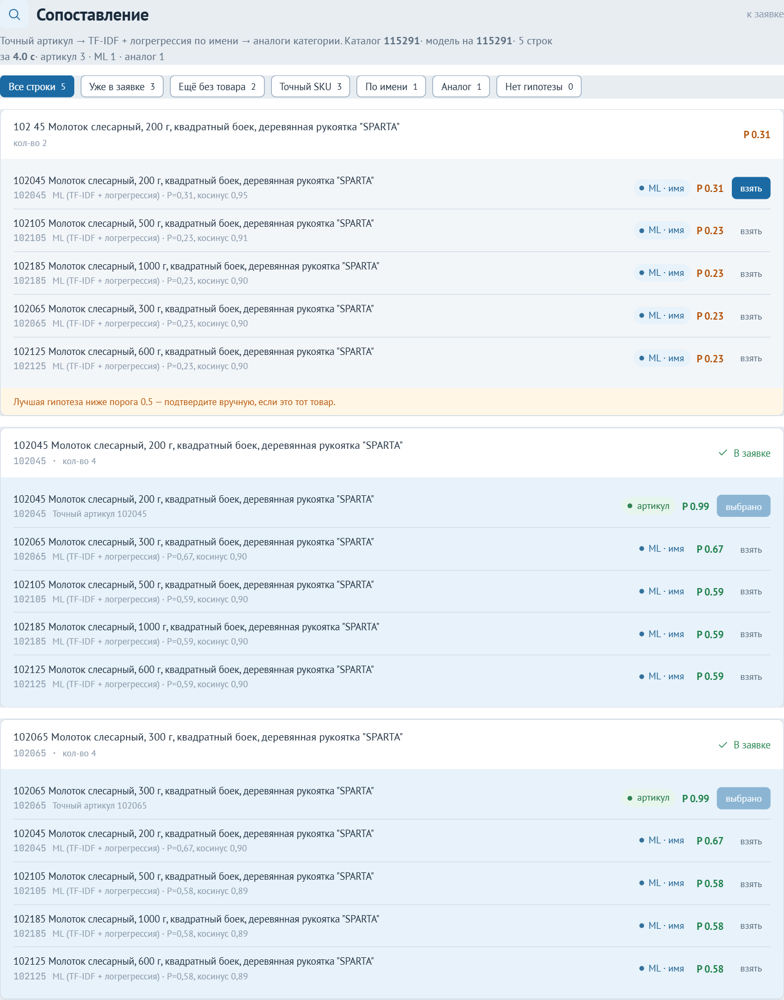
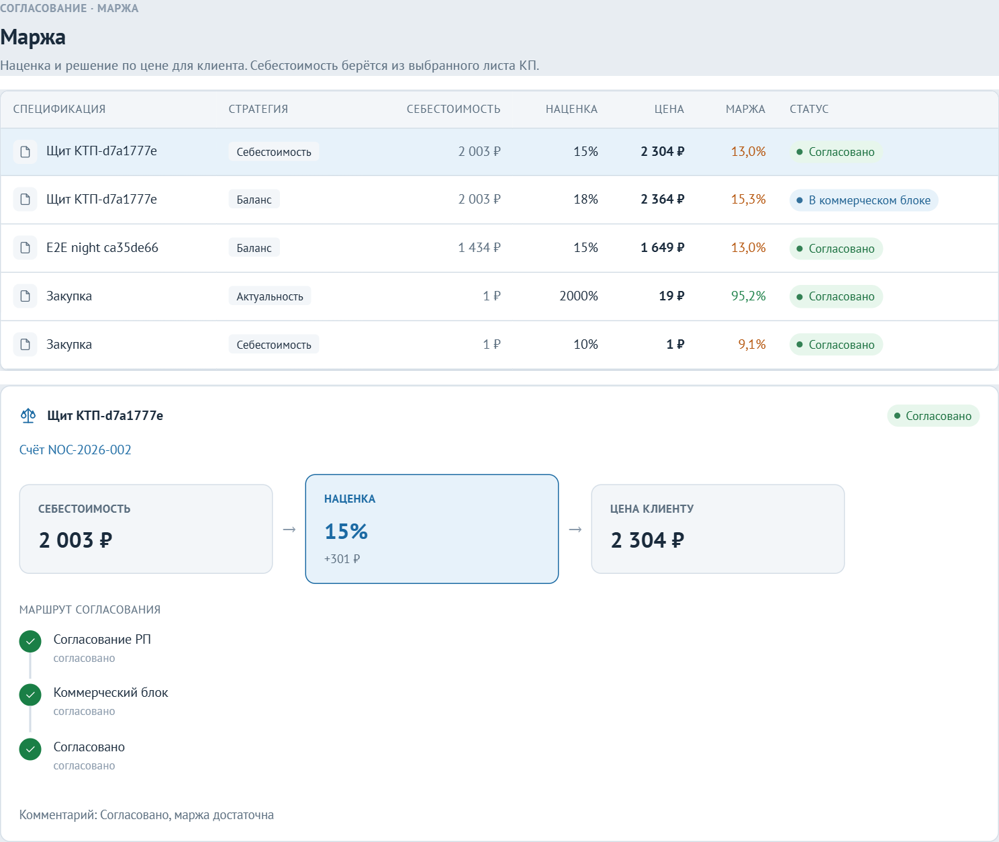

# Кварц

Система автоматизации закупок и генерации коммерческих предложений.

Сквозной контур: импорт прайсов поставщиков → каталог → спецификация проекта →
четыре варианта КП → согласование наценки → счёт → заказ со снимком цен → приёмка.

Курсовой проект, ЧелГУ. Решение: `ProcurementSystem.slnx`.

.NET 10 · ASP.NET Core · EF Core, PostgreSQL 17 · YARP · Keycloak (OIDC/JWT) ·
NATS JetStream · Meilisearch · React 19, TypeScript, Vite · ClosedXML, NPOI, QuestPDF ·
Docker Compose · xUnit

## Как выглядит

<p align="center">

</p>
<p align="center">


</p>

## Архитектура

Стенд — **strangler fig**. SPA ходит в единственную точку входа — Gateway на YARP.
Шлюз отдаёт вынесенным процессам их префиксы; остальной `/api` — модульному монолиту.

```
React SPA ──OIDC──> Keycloak
     │
     └── /api (JWT) ──> Gateway (YARP)
                          ├── Auth
                          ├── Catalog / Quoting / Matching
                          ├── Commercial / Ordering / Logistics
                          ├── Notifications / Retail
                          └── Api (поиск, проекты, аудит)

Catalog ──(Outbox)──> NATS JetStream ──> Worker ──> Meilisearch
Logistics ──(Outbox)──> GoodsReceiptCompleted ──> Commercial
```

У каждого вынесенного сервиса своя схема PostgreSQL (`catalog`, `quoting`,
`commercial`, …). Чужие агрегаты — голый `Guid` без FK. Matching своей схемы не
держит: каталог читает у Catalog, спецификации — у Quoting.

Абстракции, за которыми можно сменить реализацию, не трогая домен:

- `ISearchEngine` — сейчас Meilisearch;
- `IEventBus` — сейчас NATS JetStream;
- `IAccountingGateway` / `IWarehouseGateway` — сейчас мок-адаптеры под 1С и WMS.

Подробности — в [docs/ARCHITECTURE.md](docs/ARCHITECTURE.md).

## Решения

### Генератор считает четыре КП за один проход

Вход — спецификация, уже сопоставленная с каталогом. Выход — четыре независимых
листа и причина выбора поставщика в каждой строке.

| Стратегия | Правило |
|-----------|---------|
| Мин. цена | эффективная цена со скидкой, при равенстве — меньший срок |
| Мин. срок | срок поставки, при равенстве — меньшая цена |
| Баланс | цена и срок нормируются среди кандидатов на позицию |
| Актуальность | линейный score: сходство × свежесть прайса × остаток × цена × срок |

Скидка поставщика важнее скидки производителя. Ручной override бьёт стратегию.
НДС считается отдельно: в КП всегда суммы без и с налогом. Позиции без оффера
в итог не входят.

Согласование берёт себестоимость из того же генератора. Счёт при создании
фиксирует построчный снимок выбранного варианта.

Экспорт — Excel (ClosedXML) и PDF (QuestPDF).

### Сопоставление заявки с каталогом — не «просто Levenshtein»

1. точный артикул → `P ≈ 0.99`;
2. кандидаты: TF-IDF (токены + символьные 3-граммы) и top-12 из Meilisearch,
   плюс соседи по категории;
3. шесть признаков в `[0, 1]` (артикул, нечёткий артикул, косинус имени,
   Jaccard, категория, производитель);
4. логистическая регрессия, порог импорта `P ≥ 0.5`, подстановка аналога в КП
   `P ≥ 0.40`.

Модель дообучается на каталоге без ручной разметки: плюс — сам товар и он же
с перестановкой букв, минус — случайный другой. Импортёр прайсов прогнан на
реальном Excel (~20 тыс. строк) и на стенде «120 поставщиков × 4 тыс. SKU».

Разбор признаков — в [docs/ML_MATCHING.md](docs/ML_MATCHING.md).

### Заказ — застывший снимок, не живая ссылка на каталог

После оформления цены и поставщики в заказе не следят за прайсом. Остаток
резервируется в Catalog; при отмене возвращается, ниже нуля не уходим.
Жизненный цикл заказа и счёта живёт в сущностях (`CanTransitionTo`, линейный
поток счёта из восьми стадий) — обойти правило из соседнего сервиса нельзя.

### Событие в индекс пишется в той же транзакции, что и товар

`ProductUpserted` кладётся в Outbox тем же `SaveChanges`, что и строка каталога.
Фоновый процессор публикует в JetStream, Worker индексирует Meilisearch.
Нет коммита — нет события. Брокер лёг — процессор повторит цикл. Индексация
идемпотентна.

NATS + собственный Outbox вместо RabbitMQ + MassTransit: у MassTransit нет
транспорта под NATS. Meilisearch вместо Elasticsearch — один узел, спрятан
за `ISearchEngine`.

### Роли совпадают с акторами процесса, а не с «admin / user»

Keycloak, шесть ролей: администратор, руководитель проекта, коммерческий блок,
бухгалтерия, склад, наблюдатель. Политики на эндпоинтах: РП не согласует КП
сам себе, «Согласован» на счёте ставит только КБ, дальше — бухгалтерия.
Шлюз JWT не проверяет — проксирует заголовок, каждый сервис валидирует сам.

## Запуск

Клонировать в путь **без кириллицы**: BuildKit на Docker Desktop падает, если
в пути есть не-ASCII.

Нужны Docker Desktop (Compose v2) и свободные порты `5173`, `5160`–`5176`,
`5433`, `4222`, `7700`, `8088`.

```bash
cp .env.example .env
docker compose up --build
```

Первая сборка долгая (SDK .NET 10 + QuestPDF/Skia). Если параллельный
`compose up --build` рвёт BuildKit на Windows — `.\up-docker.ps1` собирает
образы по одному.

Открыть http://localhost:5173, логин `manager` / `manager`.
Keycloak импортирует realm из `keycloak/realm-procurement.json`.
Миграции применяет Api при старте.

Демо-пользователи (пароль = логин): `admin`, `manager`, `commercial`,
`accounting`, `warehouse`, `viewer`.

Демо-каталог: `POST /api/admin/seed` под ролью `admin`.

Остановка: `docker compose down`.

### Локальная разработка

Инфраструктура в Docker, процессы на хосте (.NET SDK 10, Node `^20.19` или `>=22.12`):

```bash
docker compose up -d postgres nats meilisearch keycloak grafana
dotnet build ProcurementSystem.slnx
dotnet run --project src/ProcurementSystem.Api --no-build        # :5165
dotnet run --project src/ProcurementSystem.Auth --no-build       # :5167
dotnet run --project src/ProcurementSystem.Worker --no-build
cd frontend && npm install && npm run dev                        # :5173
```

Сначала один `dotnet build`, затем процессы с `--no-build` — иначе Api и Worker
дерутся за `Infrastructure.dll`. Vite проксирует `/api/auth` и `/api/users` на
`:5167`, остальной `/api` — на монолит `:5165`.

## Проверка

```bash
dotnet test tests/ProcurementSystem.Tests
```

92 теста xUnit на EF Core InMemory: генератор КП, матчер, импорт Excel,
согласование, счета, заказы, приёмка, резерв остатка, уведомления.

## Документация

| Файл | О чём |
|------|--------|
| [docs/ARCHITECTURE.md](docs/ARCHITECTURE.md) | слои, strangler fig, Outbox, генератор КП, жизненные циклы |
| [docs/ML_MATCHING.md](docs/ML_MATCHING.md) | TF-IDF + логрегрессия, четвёртая стратегия КП |
| [docs/DATA_MODEL.md](docs/DATA_MODEL.md) | ER, схемы PostgreSQL, паттерн «снимок» |
| [docs/API.md](docs/API.md) | REST, кто обслуживает префикс |
| [docs/UI.md](docs/UI.md) | живой скин кабинета снабженца |
| [docs/USER_GUIDE.md](docs/USER_GUIDE.md) | сквозной прогон по ролям |
