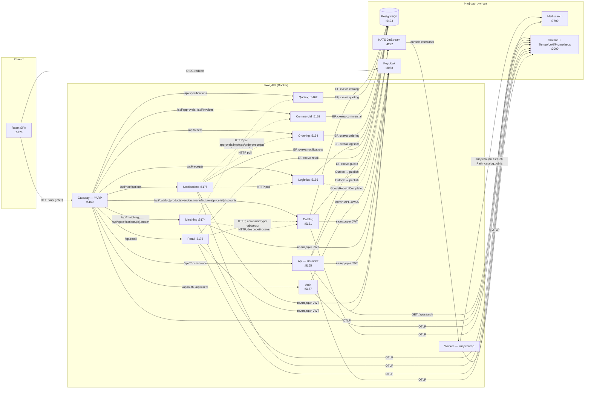
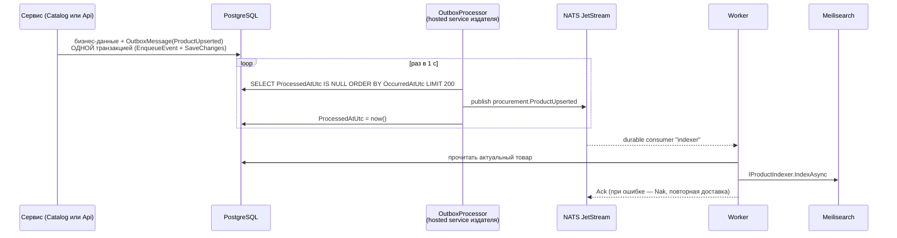
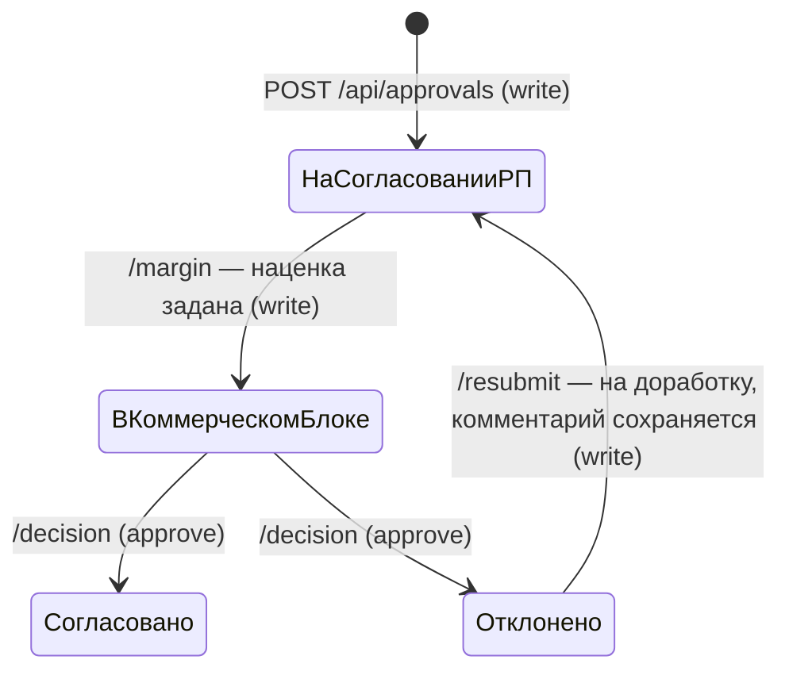
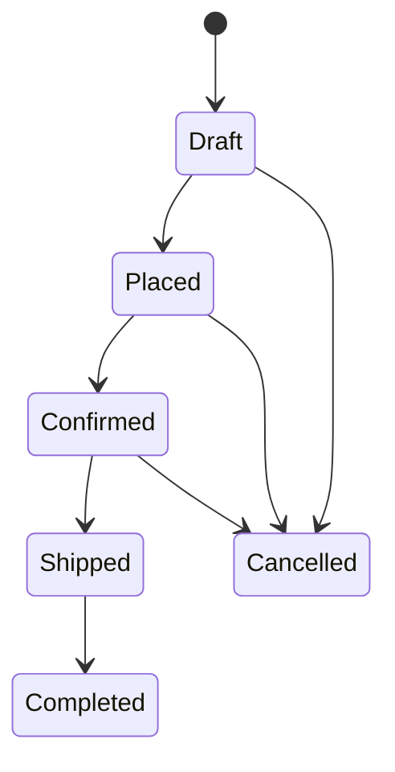

# Архитектура Procurement System

Технический документ для пояснительной записки и онбординга. Что и зачем — в [README](../README.md);
здесь — **как** система устроена внутри: слои, потоки данных, алгоритм генерации КП,
жизненные циклы документов, безопасность и наблюдаемость.

Порты в схемах — **стенд Docker Compose** (`docker-compose.yml`). На хосте у вынесенных
сервисов другие `launchSettings` (Catalog `:5168`, Quoting `:5170`, Commercial `:5169`,
Ordering `:5171`, Logistics `:5172`, Matching `:5174`, Notifications `:5175`, Retail `:5176`).

## 1. Общая схема

Система в состоянии **пошаговой миграции (strangler fig)**. Клиент в Docker ходит в
единственную точку входа — **Gateway** (YARP). Шлюз отдаёт Auth, Catalog, Quoting,
Commercial, Ordering, Logistics, Matching, Notifications и Retail вынесенным процессам; catch-all `/api/**` — всё,
что ещё в **модульном монолите** (`Api`: поиск, проекты, аналитика,
аудит, интеграции). Поиск индексирует отдельный **Worker**.

Локальный Vite (`frontend/vite.config.ts`) шлюз **не использует**: `/api/auth` и
`/api/users` проксируются на Auth `:5167`, остальной `/api` — на монолит `:5165`
(включая каталог). В Docker nginx проксирует `/api/` на Gateway (`docker/nginx.conf`).



## 2. Слои и проекты решения

Направление зависимостей — строго сверху вниз; `Domain` не зависит ни от чего.
Вынесенные сервисы **не ссылаются** на `Infrastructure`: копируют нужную логику и
свой `DbContext`, зависят только от `Domain` и `Contracts`. Шлюз не ссылается ни на
Domain, ни на Infrastructure.

| Проект | Роль | Зависит от |
|---|---|---|
| `ProcurementSystem.Domain` | Сущности, перечисления статусов, интерфейсы (`ISearchEngine`, `IEventBus`, `IAccountingGateway`, `IWarehouseGateway`, `IEmailSender`), `OutboxMessage` | — |
| `ProcurementSystem.Contracts` | События (`ProductUpserted`, `GoodsReceiptCompleted`) и поисковые документы — общий «язык» издателей и потребителей | — |
| `ProcurementSystem.Infrastructure` | EF Core (`AppDbContext`, миграции схемы `public`), сервисы бизнес-логики монолита, адаптеры внешних систем, импорт/экспорт, DI | Domain, Contracts |
| `ProcurementSystem.Api` | Монолит: тонкие контроллеры всего, что шлюз ещё не увёл; middleware аудита; `OutboxProcessor`, `AuditRetentionService`, `EmailNotificationDispatcher` | Infrastructure |
| `ProcurementSystem.Worker` | Консьюмер JetStream → переиндексация в Meilisearch (`AppDbContext`; в Compose `Search Path=catalog,public`) | Infrastructure, Contracts |
| `ProcurementSystem.Gateway` | YARP reverse proxy, единственная точка входа `/api` в Docker. JWT не проверяет — проксирует `Authorization` | — (пакеты YARP, Serilog, OTel) |
| `ProcurementSystem.Auth` | Регистрация/вход и список пользователей через Keycloak Admin API. Своей БД нет | — (JWT, Keycloak HTTP) |
| `ProcurementSystem.Services.Catalog` | Номенклатура, витрина, поставщики, производители, прайсы, скидки; свой `CatalogDbContext` (схема `catalog`), свой Outbox → NATS | Domain, Contracts |
| `ProcurementSystem.Services.Quoting` | Спецификации, ML-сопоставление, генератор КП, экспорт Excel/PDF; `QuotingDbContext` (схема `quoting`); HTTP к Catalog | Domain, Contracts |
| `ProcurementSystem.Services.Commercial` | Согласования и счета NOC; `CommercialDbContext` (схема `commercial`); HTTP к quoting; durable-консьюмер `GoodsReceiptCompleted` | Domain, Contracts |
| `ProcurementSystem.Services.Ordering` | Заказы; `OrderingDbContext` (схема `ordering`); HTTP к quoting и Catalog | Domain, Contracts |
| `ProcurementSystem.Services.Logistics` | Приёмка склада, мок/ERPNext-шлюзы 1С/WMS; `LogisticsDbContext` (схема `logistics`); HTTP к заказам; Outbox `GoodsReceiptCompleted` | Domain, Contracts |
| `ProcurementSystem.Services.Matching` | ML-подбор (TF-IDF + логрегрессия). Своей схемы нет: каталог — HTTP у Catalog и read-only `SELECT` из схемы `catalog` на большом объёме, спецификации — HTTP у Quoting. Apply пишет `ProductId` через `POST .../match/apply-one` Quoting | Domain, Contracts |
| `ProcurementSystem.Services.Notifications` | In-app колокольчик и SMTP; `NotificationsDbContext` (схема `notifications`); HTTP-опрос открытых документов Commercial/Ordering/Logistics | Domain, Contracts |
| `ProcurementSystem.Services.Retail` | Розничные витрины B2C; `RetailDbContext` (схема `retail`); HTTP к Catalog (номенклатура и цены не дублируются) | Domain, Contracts |
| `ProcurementSystem.Tests` | xUnit-тесты бизнес-логики (EF Core InMemory) | Infrastructure, Catalog, Commercial, Matching, Notifications, Retail |

Принятые в проекте соглашения:

- **Тонкие контроллеры.** Контроллер только валидирует вход, вызывает сервис
  и маппит результат в HTTP-код. Вся бизнес-логика — в сервисах.
- **Rich domain model для жизненных циклов.** Правила переходов статусов живут в самих сущностях
  (`Order.CanTransitionTo`/`TryTransitionTo`, `Invoice.LinearFlow`, `Approval.ApplyMarkup`/`Decide`/
  `ReturnForRework`, `GoodsReceipt.Complete`), сервисы приложения лишь оркеструют
  загрузку/сохранение. Так правила невозможно обойти из другого сервиса.
- **Модульные DI-точки (монолит).** Общий `DependencyInjection.AddInfrastructure()` подключает модули-расширения
  `AddCommercial()` и `AddLogistics()` — каждый модуль регистрирует свои сервисы в своём файле,
  общий файл при добавлении фичи править не нужно (это же позволило вести параллельную разработку
  двумя агентами без конфликтов мёржа).
- **CQRS-разделение в модуле Commercial.** Чтение и мутации каждого агрегата — отдельные сервисы:
  `ApprovalQueryService`/`ApprovalCommandService`, `InvoiceQueryService`/`InvoiceCommandService`
  (+ общие мапперы `CommercialMappers`). В вынесенном Commercial те же пары; фасады
  `ApprovalService` / `InvoiceService` туда не переносились.

## 3. Переход к микросервисам (strangler fig)

### Зачем

Монолит закрыл сквозной процесс ТЗ. Дальше — учебный и защищаемый шаг: вынуть
ограниченные контексты **по одному**, не ломая стенд. Паттерн — strangler fig:
новый процесс поднимается рядом, шлюз переключает префикс URL, монолит остаётся
для всего, что ещё не вынесли. На каждом шаге SPA продолжает работать.

Границы совпадают с папками `Domain` (и с бывшими модулями Infrastructure).

### Что уже вынесено в живой путь (Docker)

| Префикс шлюза | Процесс (Compose) | Порт хоста |
|---|---|---|
| `/api/auth/{**}`, `/api/users/{**}` | `auth` (`ProcurementSystem.Auth`) | 5167 |
| `/api/catalog`, `/api/products`, `/api/vendors`, `/api/manufacturers`, `/api/pricelist`, `/api/discounts` | `catalog` | 5161 |
| `/api/specifications` (включая `…/quote`, `…/import`; **кроме** `…/match`) | `quoting` | 5162 / хост-dev 5170 |
| `/api/matching/{**}`, `/api/specifications/{id}/match/{**}` | `matching` | 5174 / хост-dev 5174 |
| `/api/approvals`, `/api/invoices` | `commercial` | 5163 / хост-dev 5169 |
| `/api/orders` | `ordering` | 5164 / хост-dev 5171 |
| `/api/receipts` | `logistics` | 5166 / хост-dev 5172 |
| `/api/notifications` | `notifications` | 5175 |
| `/api/retail/{**}` | `retail` | 5176 / хост-dev 5176 |
| `/api/{**}` (catch-all, `Order: 100`) | `api` (монолит) | 5165 |

Шлюз (`gateway`, хост `:5160`) читает маршруты из `src/ProcurementSystem.Gateway/appsettings.json`.
Кластеры: `auth`, `catalog`, `quoting`, `commercial`, `ordering`, `logistics`, `matching`, `notifications`, `retail`, `monolith`.
На хосте адреса кластеров переопределяются в `Properties/launchSettings.json`. JWT шлюз не валидирует.

В монолите контроллеры Auth/Users — заглушки-комментарии («перенесено в Auth»).
Контроллеры каталога / quoting / commercial / ordering / logistics / matching / notifications / retail в `Api` **сохранены**:
прямой заход на `:5165` по-прежнему читает схему `public`. Docker-SPA через шлюз туда
по этим префиксам не ходит. `MatchingController` монолита обслуживает
`/api/specifications/{id}/match`; через шлюз этот хвост уходит в Matching `:5174`.

Эндпоинты сервисов сверены с монолитом и с `frontend/src/api/*` / страницами SPA —
расхождений, из-за которых префикс пришлось бы оставить в catch-all, нет.

### Данные

Один экземпляр PostgreSQL (`procurement`), несколько схем. Перенос `public.*` → схемы
сервисов — `tools/cutover/migrate.py` (Guid сохраняются, `ON CONFLICT (Id) DO NOTHING`,
`public.*` не удаляется). `logistics.OutboxMessages` не копируется.

| Схема | Кто пишет | Таблицы (суть) |
|---|---|---|
| `public` | монолит `Api` | всё, включая копии каталога, КП, счетов, заказов, приёмок, аудит, уведомления (дубль), `RetailShops` (дубль) |
| `catalog` | Catalog | Products, Vendors, Manufacturers, PriceListItems, PriceHistory, PriceImportUploads, Discounts, свой Outbox. Журнал аудита каталога пишется в `public.AuditEntries` (`ExcludeFromMigrations`) |
| `quoting` | Quoting | Specifications, SpecificationItems, QuoteOverrides |
| `commercial` | Commercial | Approvals, Invoices, InvoiceLines, InvoiceAttachments |
| `ordering` | Ordering | Orders, OrderLines |
| `logistics` | Logistics | GoodsReceipts, GoodsReceiptLines, свой Outbox |
| `notifications` | Notifications | Notifications (in-app + `EmailedAtUtc`) |
| `retail` | Retail | RetailShops (известные и найденные витрины). Номенклатура и цены — не здесь, HTTP у Catalog |

История миграций у каждого сервиса своя (`{schema}.__EFMigrationsHistory`).
Worker в Compose подключается с `Search Path=catalog,public`, чтобы читать товары
из схемы каталога без правки `AppDbContext`.

Чужие агрегаты в вынесенных сервисах — **голый `Guid` без FK** (тот же приём, что
снимки в монолите). Навигации вроде `SpecificationItem.Product` в `QuotingDbContext`
игнорируются.

### Как сервисы общаются

Синхронно — HTTP, Bearer входящего запроса пробрасывается (`AuthForwardHandler` /
`ForwardAuthorizationHandler`):

| Кто | К кому | Зачем | Compose (Docker DNS) | `appsettings` на хосте |
|---|---|---|---|---|
| Quoting | Catalog | номенклатура, офферы, история цены, скидки | `http://catalog:8080` | `Neighbors:Catalog:BaseUrl` (`localhost:5168`; запасной в коде — `http://catalog:8080`) |
| Matching | Catalog | номенклатура для TF-IDF. Витрина `GET /api/catalog` режет pageSize=48; на большом каталоге — read-only `SELECT` из схемы `catalog` | `http://catalog:8080` | `Neighbors:Catalog:BaseUrl` (`localhost:5168`); `ConnectionStrings:Postgres` |
| Matching | Quoting | позиции спецификации; запись `ProductId` через `POST .../match/apply-one` | `http://quoting:8080` | `Neighbors:Quoting:BaseUrl` (`localhost:5170`) |
| Commercial | Quoting | спецификация и генератор КП | `http://quoting:8080` | `Neighbors:QuotingBaseUrl` = `http://localhost:5170` |
| Ordering | Quoting | снимок КП и заказчик | `http://quoting:8080` | `Neighbors:Quoting:BaseUrl` = `http://localhost:5170` |
| Ordering | Catalog | резерв остатка `POST /api/catalog/stock/adjust` | `http://catalog:8080` | `Neighbors:Catalog:BaseUrl` |
| Logistics | Ordering | `GET /api/orders/{id}` при создании приёмки | `http://ordering:8080` | `Services:Ordering` = `http://localhost:5171` |
| Notifications | Commercial, Ordering, Logistics | открытые согласования/счета/заказы/черновики приёмок для `SyncAsync` | `http://commercial:8080`, `http://ordering:8080`, `http://logistics:8080` | `Neighbors:Commercial/Ordering/Logistics:BaseUrl` (`:5169` / `:5171` / `:5172`) |
| Retail | Catalog | вендоры/товары/офферы при импорте витрин (`POST /api/vendors|products|pricelist`) | `http://catalog:8080` | `Neighbors:Catalog:BaseUrl` (`localhost:5168`; запасной в коде — `http://catalog:8080`) |

В Compose URL соседей **заданы** (`Neighbors__Catalog__BaseUrl`, `Neighbors__QuotingBaseUrl`,
`Neighbors__Quoting__BaseUrl`, `Services__Ordering`) на вынесенные процессы — префиксы
шлюза на specifications/approvals/invoices/orders/receipts/matching/notifications/retail включены (12.5, 12.8–12.10).

Асинхронно — NATS JetStream, стрим `procurement`, subject `procurement.{TypeName}`:

- Catalog (и монолит) кладут `ProductUpserted` в свой Outbox; Worker индексирует Meilisearch.
- Logistics при проведении приёмки кладёт `GoodsReceiptCompleted` в свой Outbox
  (событие несёт `SpecificationId`). Commercial слушает subject durable-консьюмером
  `commercial-goods-receipt` и идемпотентно двигает счёт
  «ОжиданиеПоставки → ПришёлНаСклад → ОтраженоВ1С» системным актором.
  В монолите приёмка по-прежнему сама продвигает `public.Invoices` (прямой заход на `:5165`).
  Живой путь SPA через шлюз — событие Logistics → подписчик Commercial.

`POST /api/catalog/stock/adjust` есть в Catalog (политика `write`, тело `{ items: [{ productId, vendorId, quantity, sign }] }`,
ответ 204). Sign — только направление, количество по модулю; неизвестные офферы пропускаются,
ниже нуля не уходим. На вынесенном пути Ordering зовёт этот эндпоинт; 404/405 (старый монолит
без маршрута) логируются, заказ всё равно сохраняется.

### Что продублировано и почему это временно

- Контроллеры и сервисы каталога / quoting / commercial / ordering / logistics / matching / retail
  живут и в монолите, и в вынесенном проекте. Шлюз выбирает, какой процесс видит SPA.
- Таблицы одних сущностей — в `public` и в схеме сервиса. Два комплекта, без
  синхронизации строк.
- Observability, JWT-обвязка Keycloak, Outbox/NATS скопированы в сервисы: ссылка
  на `Infrastructure` запрещена, чтобы не тащить чужой `AppDbContext`.
- Логика генератора КП, матчера, импорта Excel — копии, не общая библиотека.

Это цена strangler fig, а не целевое состояние. После cutover префикса копию
в монолите можно удалить; после переноса строк — схему `public` сузить.

### Следующие шаги (по коду, не план «на потом»)

Сделано в 12.5–12.10: маршруты шлюза на specifications/approvals/invoices/orders/receipts/matching/notifications/retail;
перенос `public.*` → схемы сервисов (`tools/cutover/`, включая `RetailShops` → `retail`);
соседи в Compose по Docker DNS; `POST /api/catalog/stock/adjust`; подписчик
`GoodsReceiptCompleted` в Commercial; Matching `:5174`; Notifications `:5175`;
Retail `:5176` (схема `retail`, импорт витрин пишет в Catalog по HTTP).

Открыто:

1. Vite: проксировать `/api` на Gateway, иначе локальная разработка каталога
   расходится со стендом Docker (монолит/`public` vs Catalog/`catalog`).
2. Копии контроллеров/таблиц в монолите ещё живы — прямой `:5165` читает `public.*`.

## 4. Модули домена

| Модуль (папка Domain) | Сущности | Назначение |
|---|---|---|
| `Catalog` | `Product`, `Vendor`, `Manufacturer`, `PriceListItem` | номенклатура (иерархия категорий 1–4 уровня как путь через « / »), поставщики, офферы |
| `Quoting` | `Specification`, `SpecificationItem`, `Discount`, `QuoteOverride` | спецификации, скидки, ручной выбор поставщика в позиции |
| `Matching` | `IRelevanceMatcher` (таблицы нет) | ML-сопоставление заявки с каталогом и ранжирование актуальных офферов |
| `Commercial` | `Approval`, `Invoice`, `InvoiceLine`, `InvoiceAttachment` | согласование КБ, счёт NOC с позициями и документами |
| `Ordering` | `Order`, `OrderLine` | заказ — «застывший снимок» варианта КП |
| `Logistics` | `GoodsReceipt`, `GoodsReceiptLine` | приёмка на склад, сверка заказано/принято |
| `Pricing` | `PriceHistoryEntry`, `PriceImportUpload` | история цен, архив загрузок прайсов (оригиналы файлов — в БД) |
| `Projects` | `Project` | карточка проекта на дашборде (лёгкая обёртка над спецификацией) |
| `Retail` | `RetailShop` | известные и найденные витрины B2C (хост, шаблон поиска) |
| `Integration` | `IAccountingGateway`, `IWarehouseGateway`, `IEmailSender` | контракты шлюзов 1С, WMS и SMTP |
| `Outbox`, `Messaging`, `Search` | `OutboxMessage`, `IEventBus`, `ISearchEngine` | инфраструктурные абстракции |
| `Audit` | `AuditEntry` | журнал действий пользователей |
| `Notifications` | `Notification` | in-app и email по ролям (открытые согласования, счета, заказы, приёмки); `EmailedAtUtc` |

`Discount` в коде лежит в `Domain/Pricing`, применяется и каталогом, и генератором КП.

Сущности монолита регистрируются в `AppDbContext` двумя способами: базовые — через свойства `DbSet<T>`,
сущности модулей Commercial/Logistics — через `IEntityTypeConfiguration<T>` и
`ApplyConfigurationsFromAssembly` (сервисы модулей обращаются к ним через `db.Set<T>()`).
Это тоже наследие параллельной разработки: трекам не пришлось редактировать общий `AppDbContext`.
Вынесенные сервисы повторяют нужный кусок модели в своём контексте (см. §3).

## 5. Синхронизация поиска: Outbox → JetStream → Worker

Классическая проблема: если писать в PostgreSQL и Meilisearch двумя отдельными вызовами,
при сбое между ними индекс разъезжается с БД. Решение — **транзакционный Outbox**.
Издатели события `ProductUpserted` — монолит (`Api`) и вынесенный Catalog; у каждого
свой `OutboxProcessor` и своя таблица Outbox. Worker один, слушает JetStream.



Ключевые свойства:

- **Атомарность.** `OutboxExtensions.EnqueueEvent` добавляет запись в тот же `DbContext`,
  что и бизнес-данные — событие фиксируется тем же `SaveChanges`. Нет коммита — нет события.
- **Устойчивость к недоступности брокера.** `OutboxProcessor` просто не сможет опубликовать
  и попробует в следующем цикле; при старте оба процесса до 15 раз ждут NATS
  (`EnsureStreamAsync`, `CreateOrUpdateStreamAsync` идемпотентен).
- **At-least-once.** JetStream хранит сообщение до ack; Worker при ошибке индексации делает `Nak`,
  и сообщение доставляется повторно. Повторная индексация товара идемпотентна.
- **Замена реализаций.** Публикация — через `IEventBus` (`NatsEventBus`), индекс — через
  `ISearchEngine` (`MeilisearchSearchEngine`). Переход на RabbitMQ или Elasticsearch — это
  один новый адаптер, бизнес-код не меняется.
- **Схема каталога.** В Compose у Worker `Search Path=catalog,public`: `AppDbContext`
  без правки кода читает `Products`/`PriceListItems` из схемы `catalog`, если таблица там есть.

Помимо событийного пути есть служебный: `POST /api/admin/reindex` (монолит) — полная переиндексация
(с предварительной очисткой индекса `ISearchEngine.ClearAsync`, чтобы не оставались
осиротевшие документы). `GET /api/search` обслуживает монолит, не Catalog.

## 6. Ядро системы: генератор КП (`QuoteGenerator`)

Вход: спецификация (позиции, сопоставленные с товарами каталога при импорте), стратегия,
веса цены/срока, флаг «только в наличии». Выход: `Quote` — строки с выбранными офферами
и итоги (стоимость без/с НДС, максимальный срок, число поставщиков, несопоставленные позиции).

Живой путь SPA — генератор **Quoting** (шлюз `/api/specifications` → quoting).
Офферы и скидки приходят HTTP-снимком из Catalog, без `Include` на чужие таблицы.
Копия в монолите остаётся для прямого захода на `:5165`.

Алгоритм (один проход, 4 запроса к БД на всю спецификацию — в монолите; в сервисе —
HTTP к Catalog + локальные спецификации):

1. Загрузить спецификацию с позициями, товары (с производителем), ручные overrides
   (`QuoteOverride`) и **все офферы по товарам спецификации одним запросом**.
2. Получить активные скидки (`IDiscountService.GetActiveForAsync`) и посчитать для каждого
   оффера **эффективную цену**: `price × (1 − скидка/100)`. Приоритет — скидка **поставщика**;
   если её нет — скидка **производителя** товара (ТЗ п.5.4).
3. Для каждой позиции выбрать оффер:
   - если есть ручной override и этот поставщик среди кандидатов — берётся он
     (причина: «Выбрано вручную», ТЗ п.5.5);
   - иначе — по стратегии, **всегда по эффективной (со скидкой) цене**:

| Стратегия | Правило выбора |
|---|---|
| `MinCost` | мин. эффективная цена, при равенстве — меньший срок |
| `MinLeadTime` | мин. срок поставки, при равенстве — меньшая цена |
| `Balanced` | цена и срок нормируются в `[0..1]` **среди кандидатов на позицию**; берётся минимум взвешенного score `wPrice·nPrice + wLead·nLead` (веса нормируются на сумму) |
| `MlRelevance` | линейный score актуальности: сходство × свежесть прайса × остаток × цена × срок; несопоставленные позиции закрываются аналогом (`IRelevanceMatcher`) |

4. Каждая строка несёт «причину выбора» (`SelectionReason`) — текстовое объяснение для
   пользователя, почему выбран именно этот поставщик.
5. НДС (`Quote:VatRate`, по умолчанию 20 %) считается независимо: КП всегда содержит
   суммы и без НДС, и с НДС. Позиции без единого оффера попадают в КП как `Matched = false`
   и в итог не входят.

`GenerateAllAsync` возвращает четыре стратегии сразу — это экран «Сравнение КП»
(мин. цена / мин. срок / баланс / **ML-актуальность**).

Четвёртая стратегия не заменяет первые три: она ранжирует офферы по свежести прайса,
остатку и сходству с заявкой. Несопоставленные позиции генератор пытается закрыть
аналогом через `IRelevanceMatcher` (P ≥ 0.40). Разбор признаков и обучения —
в [ML_MATCHING.md](ML_MATCHING.md).
Экспорт: Excel (`QuoteExcelExporter`, ClosedXML) и PDF (`QuotePdfExporter`, QuestPDF).
Генерация обёрнута в span `quote.generate` (теги: стратегия, стоимость, число позиций).

Генератор **переиспользуется** выше по процессу: согласование берёт из него себестоимость,
а счёт NOC при создании фиксирует снимок позиций тем же вызовом (стратегия, скидки и
overrides воспроизводятся точно). Вынесенный Commercial делает те же два вызова по HTTP.

## 7. Бизнес-процесс и жизненные циклы

Сквозной процесс (акторы — из ТЗ):

```
Спецификация → КП (3 сценария) → Согласование КБ → Счёт NOC → Заказ → Приёмка склада → WMS/1С
     РП              РП               РП → КБ        авто / КБ→Бух.  РП        Склад        автоматически
```

Через шлюз цикл исполняют вынесенные сервисы (Auth, Catalog, Quoting, Commercial,
Ordering, Logistics, Notifications); монолит остаётся для поиска, проектов, аналитики,
аудита, retail и прямого захода на `:5165`.

**Согласование (`Approval`)** — маршрут по статусам, формулы из ТЗ
(`SellPrice = Cost × (1 + Markup/100)`, `Margin = (Sell − Cost)/Sell × 100`):



**Счёт NOC (`Invoice`)** — строго линейная цепочка из 8 стадий, переход **только на следующую**
(`ti == ci + 1`; правило-регрессия: ранняя версия разрешала перескакивать стадии).
«Отменён» — терминальный, допустим из любого нефинального состояния. Создаётся из
`Approval` в статусе «Согласовано»: при финальном `DecideAsync(approved: true)` — автоматически
(автор «Система (авто)»); ручной `POST /api/invoices` по тому же `ApprovalId` идемпотентен.
Согласование и создание счёта — два `SaveChanges`, не одна транзакция. При создании
фиксируются построчные позиции (`InvoiceLine`); документы — `InvoiceAttachment`.

Маршрут ролей (10.11): политика `setInvoiceStatus` (admin/commercial/accounting);
домен `Invoice.ActorMaySet` + `InvoiceStatusActor`. «Согласован» — только КБ (`CanApprove`);
все последующие стадии и «Отменён» — бухгалтерия (`CanPostPayment`). Отказ по роли — 403,
недопустимый переход — 409. Склад двигает счёт как системный актор (`IsSystem`), без HTTP.

```
Создан → Согласован → ОжиданиеОплаты → ЧастичнаяОплата → Оплачено
       → ОжиданиеПоставки → ПришёлНаСклад → ОтраженоВ1С        (+ Отменён)
         (КБ)           (бухгалтерия ─────────────────────────────────┘)
```

**Заказ (`Order`)** — снимок выбранного варианта КП с зафиксированными ценами и поставщиками
(последующие изменения каталога на заказ не влияют). При оформлении **резервируется складской
остаток** (`PriceListItem.StockQuantity` уменьшается, при отмене — возвращается, не ниже нуля):



В монолите резерв — прямая запись в `PriceListItem`. Вынесенный Ordering зовёт
`POST /api/catalog/stock/adjust` у Catalog (см. §3).

**Приёмка (`GoodsReceipt`)** — создаётся из заказа (снимок строк), по строкам сверяется
заказано/принято (`Discrepancy = Received − Ordered`). Проведение (`/complete`):

1. документ выгружается в WMS (`IWarehouseGateway`) и 1С (`IAccountingGateway`),
   их ссылки сохраняются (`WarehouseRef`, `AccountingRef`);
2. **сшивка процессов** в монолите: находится счёт NOC той же спецификации в стадии «ОжиданиеПоставки»
   и через валидацию `Invoice` автоматически продвигается `ПришёлНаСклад → ОтраженоВ1С` —
   цикл замыкается без ручных действий бухгалтерии.
   Вынесенный Logistics вместо UPDATE счёта публикует `GoodsReceiptCompleted`
   (`SpecificationId` в payload); Commercial обрабатывает событие идемпотентно
   (повтор после частичного успеха доводит «ПришёлНаСклад» до «ОтраженоВ1С»).

## 8. Импорт и экспорт файлов

- **Прайсы** (`/api/pricelist/import?vendorId=`): в Docker — Catalog, локальный Vite —
  монолит. Гибкий маппинг колонок — строка заголовков ищется в первых 30 строках **на любом
  листе** книги (не только на первом), колонки распознаются по именам, «Производитель»/«Срок»/«Остаток»
  опциональны; приоритет цене «без НДС» (НДС добавляет генератор КП). Формат `.xls`
  определяется по OLE2-сигнатуре; NPOI переливает **все** листы в ClosedXML — дальше общий конвейер.
  Путь иерархии длиннее 300 символов сжимается с сохранением корня и нижних уровней.
  Пакетное сохранение (~20 тыс. строк за ~33 с, проверено реальным прайсом EKF).
  Каждая загрузка архивируется (`PriceImportUpload`: оригинал файла + итоги + ошибки построчно);
  битый файл не роняет запрос, а фиксируется с понятной ошибкой. Дубли SKU в файле — предупреждение.
  Изменение цены оффера пишет `PriceHistoryEntry` **в той же транзакции**.
- **Спецификации** (`/api/specifications/import`): через шлюз — Quoting. Сопоставление позиции с каталогом — сначала
  точный артикул, затем fuzzy-подбор по наименованию через `ISearchEngine`; перед записью FK
  проверяется существование товара в БД (защита от осиротевших документов индекса).
  Копия в Quoting кандидатов из Meilisearch не берёт — только TF-IDF, артикул и категория.
- **Экспорт КП**: `.xlsx` (ClosedXML) и PDF (QuestPDF, A4 landscape, скидки и итоги без/с НДС).

## 9. Безопасность

- **Аутентификация** — Keycloak (realm `procurement` автоимпортируется из
  `keycloak/realm-procurement.json`). SPA входит по OIDC Authorization Code + PKCE
  (public-клиент `procurement-api`) и дополнительно умеет `POST /api/auth/login` /
  `POST /api/auth/register` (сервис Auth, Keycloak Resource Owner Password + Admin API).
  Каждый API-процесс (Auth, Catalog, монолит, вынесенные сервисы) сам валидирует JWT
  (`Authority` = realm; издатель и подпись, без проверки audience в dev). Шлюз токен
  не проверяет, только проксирует заголовок. Realm-роли разворачиваются из claim
  `realm_access.roles` в стандартные Role-claims в `OnTokenValidated`.
- **Авторизация** — `FallbackPolicy` требует аутентификацию для всего (кроме `/health`);
  6 ролей по акторам ТЗ и точечные политики `read` / `write` / `approve` / `postPayment` /
  `setInvoiceStatus` / `receive` / `admin` (матрица — в [README](../README.md#аутентификация-и-роли)).
  `setInvoiceStatus` (admin, commercial, accounting) открывает `POST /api/invoices/{id}/status`;
  какую стадию можно ставить, решает домен: `Invoice.ActorMaySet` + `InvoiceStatusActor`
  («Согласован» — КБ, дальше и «Отменён» — бухгалтерия; системный актор склада не ограничен).
  Роли не пересекаются (кроме admin) — разделение обязанностей: РП не может согласовать КП
  сам себе, бухгалтерия не может поставить «Согласован» (403). Политики скопированы в каждый
  вынесенный сервис.
- **Аудит** — два канала. `AuditMiddleware` монолита логирует каждую мутацию
  (POST/PUT/DELETE/PATCH) аутентифицированных пользователей: кто, метод, путь, код.
  `AuditSaveChangesInterceptor` (EF) дополнительно пишет `AuditEntry.ChangesJson` (jsonb) —
  значения «было → стало» по белому списку Discount, Order, Invoice, Approval, GoodsReceipt,
  PriceListItem (новые офферы импорта не пишутся, только изменения существующих).
  Catalog пишет в ту же таблицу `public.AuditEntries` (`ExcludeFromMigrations`).
  Чтение — `GET /api/audit`, только `admin`; экран журнала показывает изменения.
  Ретенция — фоновый `AuditRetentionService` (`Audit:RetentionDays`, по умолчанию 1095 дней ≈ 3 года,
  пакетное `ExecuteDeleteAsync`).

## 10. Наблюдаемость

Общая точка подключения монолита и Worker — `AddObservability(serviceName)`
(Infrastructure/Observability). Вынесенные сервисы и шлюз не ссылаются на Infrastructure:
у каждого своя копия `ObservabilityExtensions` / разводка в `Program.cs`, имя
`service` своё (`procurement-gateway`, `procurement-auth`, `procurement-catalog`, …).

- **Логи** — Serilog: консоль, обогащение полем `service`, конфигурация из секции `Serilog`;
  в HTTP-хостах — `UseSerilogRequestLogging` (метод, путь, код, длительность, TraceId).
- **Трассы, логи и метрики** — OpenTelemetry с экспортом OTLP gRPC (`Otlp:Endpoint` → Grafana). Один контейнер `grafana/otel-lgtm`: Tempo, Loki, Prometheus и Grafana поверх них. Jaeger убран: он принимал только трассы, метрики и логи уходили в никуда.
  Инструментация: AspNetCore, HttpClient, EF Core (где есть БД), источник `NATS.Net`, runtime-метрики,
  собственный `ActivitySource` `ProcurementSystem`. У шлюза — AspNetCore + исходящий HttpClient,
  чтобы трасса не обрывалась на прокси.
- **Кастомные спаны**: `quote.generate` (генератор КП), `index.product` (Worker),
  `integration.1c.post` / `integration.wms.receipt` (мок-шлюзы), `integration.email.send` (SMTP),
  `invoice.advance-from-receipt` (подписчик Commercial).
- Трасса **сквозная**: publish в Outbox-процессоре и receive в Worker связаны — путь
  издатель → JetStream → Worker → Meilisearch виден в Grafana одной трассой, и из спана можно провалиться в логи того же запроса.
  Запрос Docker-SPA дополнительно начинается на шлюзе.

## 11. Интеграции с внешними системами

Контракты `IAccountingGateway` (1С) и `IWarehouseGateway` (WMS) объявлены в Domain,
бизнес-логика (`WarehouseService`) работает только с ними. По умолчанию подключены мок-адаптеры
(`MockAccountingGateway`, `MockWarehouseGateway`) — они возвращают правдоподобные ссылки
документов и создают OTel-спаны. Переключатель `ExternalAccounting:Mode`: `Mock` (стенд) или
`ErpNext` (`ErpNextAccountingGateway` — тот же контракт, реальный HTTP к ERPNext).
Подключение настоящей 1С — ещё один адаптер в DI, приём тот же, что с `ISearchEngine`/`IEventBus`.
Статус шлюзов — `GET /api/integration/status` (монолит). Копии адаптеров есть в Logistics.

Email (ТЗ §12) — тот же приём: `IEmailSender` в Domain. Живой путь — сервис
`ProcurementSystem.Services.Notifications`: `SmtpEmailSender` (спан `integration.email.send`)
или `NoOpEmailSender` при `Email:Enabled=false`. Диспетчер `EmailNotificationDispatcher`
раз в N секунд вызывает `NotificationService.SyncAsync` (HTTP-опрос открытых документов
у Commercial/Ordering/Logistics; NATS-события не берём — у Commercial/Ordering нет Outbox,
а `GoodsReceiptCompleted` не покрывает черновики приёмок) и шлёт ещё не отправленные на
`Email:Recipients:{role}`. `Notification.EmailedAtUtc` исключает дубли. В Compose — `mailhog`
(SMTP 1025, UI http://localhost:8025), у `notifications` — `Email__Enabled=true`. У монолита
`Email__*` можно оставить: почту шлёт новый сервис, контроллер/диспетчер в `Api` сохранены
на случай прямого захода на `:5165`. На хосте у монолита email по умолчанию выключен.

## 12. Осознанные отклонения от исходной заявки

| Заявлено | Сделано | Почему |
|---|---|---|
| RabbitMQ + MassTransit | NATS + JetStream (`NATS.Net`), Outbox вручную | у MassTransit нет и не планируется транспорта под NATS; JetStream даёт durable-доставку и реплей; ручной Outbox — меньше «магии», понятнее для защиты |
| Elasticsearch | Meilisearch | легче на порядок, один узел, мгновенный fuzzy из коробки; спрятан за `ISearchEngine` — переход на ES не трогает бизнес-код |
| .NET 8 | .NET 10 (LTS) | актуальный LTS на машине разработки; новый формат решения `.slnx` |

Общий принцип: реалистичный объём для одного разработчика за семестр, но каждое упрощение
закрыто абстракцией, чтобы «взрослая» реализация подключалась без переписывания.

Миграция к сервисам — не из исходной заявки; это следующий шаг после модульного монолита,
закрытый шлюзом и выносом по префиксам URL (см. §3).

## 13. Известные ограничения (осознанный техдолг)

Актуальная сверка с ТЗ — в [TZ_COVERAGE.md](TZ_COVERAGE.md). Пункты дорожной карты
**12.5** (маршруты шлюза), **12.6** (перенос `public.*` → схемы сервисов), **12.7**
(соседи в Compose, `stock/adjust`, подписчик приёмки), **12.8** (Matching), **12.9**
(Notifications) и **12.10** (Retail) закрыты — см. §3.

Уже сделано, но упрощено относительно формулировок ТЗ:

- аналитика — живая сводка, без периода/фильтров/выгрузки отчёта;
- уведомления — сервис Notifications (in-app + SMTP/MailHog); у монолита на хосте email выключен;
- шлюзы 1С/WMS — моки (`ExternalAccounting:Mode=Mock`); есть выключаемый адаптер ERPNext
  на том же контракте `IAccountingGateway`;
- круг согласователей NOC — одна стадия «Согласован» (её ставит КБ), не цепочка лиц;
- **Matching читает схему `catalog` напрямую** (`ConnectionStrings:Postgres`) — нарушение правила
  «каждый сервис владеет своими данными». Причина измеримая: витрина каталога отдаёт максимум
  48 позиций на страницу, на стенде 115 865 SKU, полный снимок по HTTP не укладывается в таймаут.
  «Только на чтение» здесь по договорённости, а не по правам БД. Чем закрывать: отдельная роль
  PostgreSQL с `GRANT SELECT` на схему `catalog`, пакетный экспорт у Catalog или локальная
  проекция в Matching, обновляемая событиями Outbox;
- **Notifications ходит к соседям под учётной записью `admin`** (`Neighbors:ServiceUser/Password`,
  password grant) — упрощение стенда. Чем закрывать: отдельная служебная учётная запись только
  с правами чтения нужных префиксов либо клиент Keycloak с client credentials.

Список пользователей (`GET /api/users`) после выноса Auth читается из Keycloak Admin API,
не из JWT/аудита монолита. CRUD учёток по-прежнему в админке Keycloak, не в SPA.

Остаток cutover (Vite на шлюз, retail vs схема catalog, копии в монолите) — в §3.

`ValidateAudience = false` и открытые dev-пароли допустимы только для локального стенда.
