# Модель данных

Реляционная БД — **один** PostgreSQL (`procurement`), несколько схем. Диаграмма и поля —
по сущностям `ProcurementSystem.Domain`. Миграции Code First применяются при старте
процесса-владельца: монолит (`AppDbContext` → схема `public`), Catalog / Quoting /
Commercial / Ordering / Logistics — свои `*DbContext` и `{schema}.__EFMigrationsHistory`.
Общая архитектура и разнесение по сервисам — в [ARCHITECTURE.md](ARCHITECTURE.md) §3.

Пока strangler fig не закончен, одни и те же сущности существуют **дважды**: в `public`
(монолит) и в схеме вынесенного сервиса. Живой Docker-трафик каталога пишет в `catalog.*`;
спецификации, счета, заказы, приёмки SPA по-прежнему читает из `public.*`. Строки между
схемами не синхронизируются.

## ER-диаграмма

Сплошные связи — реальные внешние ключи с навигационными свойствами. Пунктирные — «слабые»
логические связи по `Guid` **без FK-ограничения**: это осознанный приём для **снимков**
(заказ, счёт, приёмка фиксируют данные на момент создания) и для развязки модулей, чтобы
изменения в одном не ломали другой.

```mermaid
erDiagram
    VENDOR      ||--o{ PRICELISTITEM   : "предлагает"
    PRODUCT     ||--o{ PRICELISTITEM   : "продаётся как"
    PRODUCT     ||--o{ PRICEHISTORYENTRY : "история цены"
    VENDOR      ||--o{ DISCOUNT         : "скидка по вендору"
    VENDOR      ||--o{ PRICEIMPORTUPLOAD : "загрузки прайсов"

    SPECIFICATION ||--o{ SPECIFICATIONITEM : "содержит"
    PRODUCT       |o--o{ SPECIFICATIONITEM : "сопоставлен"
    SPECIFICATIONITEM ||--o| QUOTEOVERRIDE : "ручной выбор"
    VENDOR        |o--o{ QUOTEOVERRIDE     : "выбранный вручную"

    SPECIFICATION ||..o{ APPROVAL : "источник КП"
    APPROVAL      ||--o{ INVOICE  : "порождает счёт"
    INVOICE       ||--o{ INVOICELINE       : "позиции"
    INVOICE       ||--o{ INVOICEATTACHMENT : "документы"

    SPECIFICATION ||..o{ ORDER      : "снимок КП"
    ORDER         ||--o{ ORDERLINE  : "позиции"
    ORDER         ||..o{ GOODSRECEIPT : "приёмка"
    GOODSRECEIPT  ||--o{ GOODSRECEIPTLINE : "позиции"

    SPECIFICATION |o..o| PROJECT : "карточка проекта"

    VENDOR {
        guid   Id PK
        string Name
        string Inn
        int    DefaultLeadTimeDays
    }
    PRODUCT {
        guid   Id PK
        string Sku
        string Name
        string Manufacturer "денормализовано"
        string Category "путь 1–4 уровня через ' / '"
    }
    PRICELISTITEM {
        guid    Id PK
        guid    VendorId FK
        guid    ProductId FK
        decimal Price
        string  Currency
        int     LeadTimeDays
        int     StockQuantity "резервируется заказом"
        string  SourceUrl "карточка витрины, если не Excel"
    }
    MANUFACTURER {
        guid   Id PK
        string Name
        string Country
        bool   IsActive
    }
    SPECIFICATION {
        guid   Id PK
        string Title
        string Customer
    }
    SPECIFICATIONITEM {
        guid   Id PK
        guid   SpecificationId FK
        guid   ProductId FK "null = не сопоставлено"
        string RawSku
        string RawName
        int    Quantity
    }
    QUOTEOVERRIDE {
        guid   Id PK
        guid   SpecificationItemId FK "уникальный"
        guid   VendorId
    }
    DISCOUNT {
        guid     Id PK
        guid     VendorId FK "или Manufacturer"
        string   Manufacturer
        decimal  Percent
        datetime ValidFromUtc
        datetime ValidToUtc
    }
    APPROVAL {
        guid    Id PK
        guid    SpecificationId "логическая связь"
        string  Strategy
        decimal CostPrice
        decimal MarkupPercent
        decimal SellPrice
        decimal MarginPercent
        enum    Status
    }
    INVOICE {
        guid    Id PK
        string  Number
        guid    ApprovalId FK
        string  Contract
        decimal SellPrice
        enum    Status "8 стадий"
    }
    INVOICELINE {
        guid    Id PK
        guid    InvoiceId FK
        string  Sku
        string  Name
        int     Quantity
        decimal UnitCost
        decimal UnitPrice
    }
    INVOICEATTACHMENT {
        guid   Id PK
        guid   InvoiceId FK
        string FileName
        bytes  FileContent "bytea"
    }
    ORDER {
        guid    Id PK
        string  Number
        guid    SpecificationId "логическая связь"
        string  Title
        string  Customer
        string  Strategy
        enum    Status
        decimal TotalCost
        string  CreatedBy
    }
    ORDERLINE {
        guid    Id PK
        guid    OrderId FK
        string  Name
        int     Quantity
        guid    VendorId
        decimal UnitPrice
    }
    GOODSRECEIPT {
        guid   Id PK
        guid   OrderId "снимок заказа"
        string OrderNumber
        enum   Status
        string WarehouseRef "из WMS"
        string AccountingRef "из 1С"
    }
    GOODSRECEIPTLINE {
        guid   Id PK
        guid   GoodsReceiptId FK
        string Name
        int    OrderedQty
        int    ReceivedQty "Discrepancy вычисляется"
    }
    PRICEHISTORYENTRY {
        guid    Id PK
        guid    ProductId
        guid    VendorId
        decimal Price
        int     LeadTimeDays
        datetime RecordedAtUtc
    }
    PRICEIMPORTUPLOAD {
        guid   Id PK
        guid   VendorId FK
        string FileName
        bytes  FileContent "оригинал, bytea"
        int    ProductsCreated
        int    ErrorsCount
    }
    PROJECT {
        guid     Id PK
        string   Name
        string   Rp
        datetime DueDateUtc
        guid     SpecificationId "логическая связь"
    }
    NOTIFICATION {
        guid     Id PK
        string   RecipientUserName "конкретный пользователь"
        string   RecipientRole "роль-адресат"
        string   Type
        string   Title
        string   Message
        string   RelatedEntityType
        guid     RelatedEntityId "логическая связь"
        string   DedupeKey UK
        datetime CreatedAtUtc
        datetime ReadAtUtc "null = непрочитано"
        datetime EmailedAtUtc "null = ещё не ушло письмом"
    }
    RETAILSHOP {
        guid     Id PK
        string   Host UK
        string   DisplayName
        string   Kind "Known / Discovered"
        string   SearchUrlTemplate
        datetime FirstSeenUtc
        datetime LastSuccessUtc
        string   LastError
        int      HitCount
    }
    AUDITENTRY {
        guid     Id PK
        string   UserName
        string   Action "HTTP-метод"
        string   Path
        int      StatusCode
        datetime OccurredAtUtc
        jsonb    ChangesJson "массив old/new по полям"
    }
```

Вне связей на диаграмме (и сущности без таблицы):

- **`MANUFACTURER`** — справочник производителей (ТЗ п.5.2). Сознательно **не** связан внешним
  ключом с `PRODUCT`: у товара производитель хранится строкой (`Product.Manufacturer`,
  денормализовано), а справочник — отдельное место ведения списка брендов со страной и статусом.
- **`AUDITENTRY`** — журнал действий (кто/метод/путь/код/время + `ChangesJson`).
  HTTP-мутации пишет `AuditMiddleware` монолита; значения «было → стало» — `AuditSaveChangesInterceptor`
  (белый список Discount, Order, Invoice, Approval, GoodsReceipt, PriceListItem; новые офферы
  импорта не пишутся). Catalog пишет в ту же таблицу `public.AuditEntries`
  (`ToTable(..., "public", ExcludeFromMigrations)`). Ни на что не ссылается.
- **`OUTBOXMESSAGE`** — техническая таблица паттерна Outbox (тип события + JSON-payload +
  `ProcessedAtUtc` + `Error`). Есть в `public` (монолит), в `catalog` и в `logistics`.
- **`NOTIFICATION`** — in-app и email. Адресат — роль (`RecipientRole`) или конкретный
  пользователь (`RecipientUserName`); `RelatedEntityId` ссылается на документ логически, без FK.
  `DedupeKey` уникален, чтобы одно и то же согласование/счёт не плодило дубли.
  `EmailedAtUtc` — письмо уже ушло (или помечено, если получателей роли нет); миграция
  `AddNotificationEmailedAt` проставляет его у старых строк, чтобы не было залпа писем.
- **`RETAILSHOP`** — витрина B2C (`Domain/Retail`). Живая таблица — схема `retail`
  (`Services.Retail`). Импорт (`POST /api/retail/import`) создаёт
  `Vendor`/`Product`/`PriceListItem` в Catalog по HTTP, без FK на магазин.
  Копия в `public."RetailShops"` остаётся у монолита.
- **Matching** — не сущность БД. `IRelevanceMatcher` + DTO `MatchSuggestion` / enum `MatchKind`
  (`ExactSku` / `FuzzyName` / `Analog`). Модель живёт в памяти процесса.

## Схемы PostgreSQL

Один инстанс, несколько схем. Вынесенный сервис при старте делает `Database.Migrate()`
только своей схемы.

| Схема | Владелец | Что лежит |
|---|---|---|
| `public` | монолит `Api` | полный набор таблиц (каталог, КП, коммерция, заказы, склад, проекты, retail-дубль, аудит, уведомления, outbox) |
| `catalog` | `Services.Catalog` | Products, Vendors, Manufacturers, PriceListItems, PriceHistory, PriceImportUploads, Discounts, OutboxMessages. `AuditEntries` мапится на `public.AuditEntries` без миграций схемы catalog |
| `quoting` | `Services.Quoting` | Specifications, SpecificationItems, QuoteOverrides. `Product` в контексте игнорируется (голый Guid) |
| `commercial` | `Services.Commercial` | Approvals, Invoices, InvoiceLines, InvoiceAttachments |
| `ordering` | `Services.Ordering` | Orders, OrderLines |
| `logistics` | `Services.Logistics` | GoodsReceipts, GoodsReceiptLines, OutboxMessages |
| `notifications` | `Services.Notifications` | Notifications |
| `retail` | `Services.Retail` | RetailShops. Номенклатура и цены не копируются — HTTP у Catalog |

Worker в Compose: `Search Path=catalog,public` — `Products` резолвятся в схему каталога,
если таблица там есть. Скидки в Domain лежат в папке `Pricing`, таблица `Discounts` —
и в `public`, и в `catalog`.

## Базовые классы

Почти все сущности наследуют общие поля:

| Класс | Поля | Кто наследует |
|---|---|---|
| `Entity` | `Id` (Guid, генерируется в приложении) | все |
| `AuditableEntity : Entity` | `+ CreatedAtUtc`, `UpdatedAtUtc` | все, кроме «строк» (`*Line`, `SpecificationItem`) и служебных (`AuditEntry`, `PriceHistoryEntry`, `OutboxMessage`) |

## Паттерн «снимок» (snapshot)

Ключевое проектное решение: **заказ, счёт и приёмка не ссылаются на «живой» каталог, а копируют
нужные данные в свои строки** на момент создания. Поэтому у `OrderLine`, `InvoiceLine`,
`GoodsReceiptLine` есть собственные `Name`, `Sku`, `VendorName`, `UnitPrice` — они не меняются,
даже если позже отредактируют товар, цену оффера или удалят поставщика. Это требование
предметной области: цена и поставщик в оформленном заказе/счёте должны быть неизменными.
Именно из-за снимков связи `Specification→Order`, `Approval→...`, `Order→GoodsReceipt`
показаны на диаграмме пунктиром — жёсткий FK здесь был бы вреден.

## Ключевые справочники статусов (enum)

Хранятся строками (в JSON — тоже строками, `JsonStringEnumConverter`):

| Enum | Значения |
|---|---|
| `OrderStatus` | `Draft → Placed → Confirmed → Shipped → Completed`, `Cancelled` |
| `InvoiceStatus` | `Создан → Согласован → ОжиданиеОплаты → ЧастичнаяОплата → Оплачено → ОжиданиеПоставки → ПришёлНаСклад → ОтраженоВ1С`, `Отменён` |
| `ApprovalStatus` | `НаСогласованииРП → ВКоммерческомБлоке → Согласовано / Отклонено` |
| `ReceiptStatus` | `Черновик → Проведено`, `Отменена` |
| `QuoteStrategy` | `MinCost`, `MinLeadTime`, `Balanced`, `MlRelevance` |

Правила переходов между статусами — не в БД, а в доменных сущностях (rich domain model),
см. [ARCHITECTURE.md §7](ARCHITECTURE.md#7-бизнес-процесс-и-жизненные-циклы).
